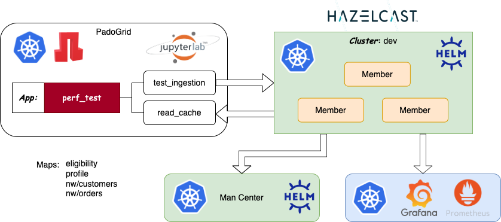

 [*PadoGrid*](https://github.com/padogrid) | [*Catalogs*](https://github.com/padogrid/catalog-bundles/blob/master/all-catalog.md) | [*Manual*](https://github.com/padogrid/padogrid/wiki) | [*FAQ*](https://github.com/padogrid/padogrid/wiki/faq) | [*Releases*](https://github.com/padogrid/padogrid/releases) | [*Templates*](https://github.com/padogrid/padogrid/wiki/Using-Bundle-Templates) | [*Pods*](https://github.com/padogrid/padogrid/wiki/Understanding-Padogrid-Pods) | [*Kubernetes*](https://github.com/padogrid/padogrid/wiki/Kubernetes) | [*Docker*](https://github.com/padogrid/padogrid/wiki/Docker) | [*Apps*](https://github.com/padogrid/padogrid/wiki/Apps) | [*Quick Start*](https://github.com/padogrid/padogrid/wiki/Quick-Start)

---

<!-- Platforms -->
[](https://github.com/padogrid/padogrid/wiki/Platform-Host-OS)

# Hazelcast Kubernetes Helm Charts

This bundle deploys Hazelcast using Helm Charts using `kubectl`. It also includes the PadoGrid container for ingesting mock data into the Hazelcast cluster.

## Installing Bundle

```bash
install_bundle -force -download bundle-hazelcast-3n4n5-k8s-kubectl_helm
```

## Use Case

This bundle installs Hazelcast and PadoGrid containers to run on Kubernetes. It demonstrates how to start Hazelcast using Helm Charts, install `ingress-nginx` for exposing HTTPS routes, and use the PadoGrid pod to ingest mock data into Hazelcast.



## Required Software

- Kubernetes CLI, **kubectl**
- [Helm](https://helm.sh/docs/intro/install/), **helm**
- `openssl`

## Bundle Contents

```console
k8s
└── kubectl_helm
    ├── bin_sh
    │   ├── build_app
    │   ├── cleanup
    │   ├── copy_jar_to_pvc
    │   ├── create_keystores
    │   ├── list_keystores
    │   ├── login_padogrid_pod
    │   ├── remove_keystores
    │   ├── setenv.sh
    │   ├── start_dashboard
    │   ├── start_hazelcast
    │   ├── start_ingress
    │   ├── start_monitor
    │   ├── start_padogrid
    │   ├── stop_dashboard
    │   ├── stop_hazelcast
    │   ├── stop_ingress
    │   ├── stop_monitor
    │   └── stop_padogrid
    ├── dashboard
    │   ├── admin-user.yaml
    │   └── crb.yaml
    ├── etc
    │   └── hazelcast-enterprise
    ├── hazelcast
    │   ├── hz-secret.yaml
    │   ├── jar-pod.yaml
    │   ├── jar-pvc.yaml
    │   ├── mc-ingress-enterprise.yaml
    │   ├── mc-ingress-oss.yaml
    │   ├── mc-secret.yaml
    │   └── values.yaml
    ├── monitor
    │   ├── expose-prometheus.yaml
    │   ├── prometheus-instance.yaml
    │   ├── prometheus-operator.yaml
    │   ├── prometheus-rbac.yaml
    │   └── service-monitor.yaml
    └── padogrid
        ├── padogrid-configmap-enterprise.yaml
        ├── padogrid-configmap-oss.yaml
        ├── padogrid-ingress.yaml
        ├── padogrid-no-pvc.yaml
        ├── padogrid.yaml
        └── pv-hostPath.yaml
```

## Kubernetes Resources

This bundle requires a minimum of 4 CPUs and 8GB memory. For example, you can configure Minikube as follows.

```bash
minikube config set cpus 4
minikube config set memory 10240
```

## 1. Build Local Environment

Run `build_app` which initializes your local environment. This script sets the license key in the `hazelcast/secret.yaml` file.

```bash
cd_k8s kubectl_helm/bin_sh
./build_app
```
### 1.1. Changing Container Versions

The container image versions can be changed as needed in the files shown below.

```bash
# Change dir to the k8s installation directory
cd_k8s kubectl_helm
```

| Container                     | File                   |
| ----------------------------- | ---------------------- |
| PadoGrid                      | padogrid/padogrid.yaml | 
| Hazelcast                     | hazelcast/values.yaml  | 

## 2. Change Kubernetes Context

Change context to your Kubernetes environment.

**Minikube:**

```bash
kubectl config get-contexts
kubectl config use-context minikube
```

**Docker Desktop Kubernetes:**

```bash
kubectl config get-contexts
kubectl config use-context docker-desktop
```

## 3. Create Kubernetes Namespace

Let's create the **`kubectl-helm`** namespace. You can create a project with a different name but make sure to replace `kubectl-helm` with your namespace name throughout this article and set `NAMESPACE` in `kubectl-helm/bin_sh/setenv.sh`.

```bash
# Create namespace
kubectl create namespace kubectl-helm

# Switch namespace
kubectl config set-context --current --namespace=kubectl-helm
```

## 4. Optional: Install Ingress for Managment Center HTTPS

Optionally, we can use `https` instead of `http` to login to Hazelcast Management Center. To achieve this, we need to install `ingress-nginx` and set ingress rules by running `start_ingress`.

### 4.1. Minikube

If you are running `minikube` then you can enable the NGINX Ingress controller as follows.

```bash
minikube addons enable ingress
```

### 4.2. Other Kubernete Variants

If your Kubernetes does not include ingress, then you can install it by running the include `start_ingress` script, which performs the following.

- Installs `ingress-nginx` in the `ingress-nginx` namespace
- Generates self-sign key/certificate using `openssl`
- Creates the `mc-tls-secret` secret containing the self-signed key and certificate
- Applies the HTTPS rules in the `hazelcast/ingress.yaml` file


#### 4.2.1 Hazelcast Enterprise Ingress

```bash
cd_k8s kubectl_helm/bin_sh
./start_ingress
```

#### 4.2.2 Hazelcast OSS Ingress

```bash
cd_k8s kubectl_helm/bin_sh
./start_ingress -oss
```

## 5. Optional: Launch Prometheus Operator and Grafana

```bash
cd_k8s kubectl_helm/bin_sh
./start_monitor
```

### 5.1. Minikube, Docker Desktop Kubernetes

Port-foward Prometheus:

```bash
kubectl port-forward svc/prometheus-operated 9090:9090
```

- Prometheus URL: <http://localhost:9090>

Port-foward Grafana:

```bash
kubectl port-forward svc/grafana 3000:3000
```

- Grafana URL: <http://localhost:3000>

### 5.2. Grafana: Add Prometheus Data Source

From the Grafana link, configure Prometheus as follows.

- Select *Data Source*
- Select *Prometheus*
- From the *Prometheus* page, enter HTTP URL: **`http://prometheus.kubectl-helm.svc.cluster.local:9090`**
- Select *Save & test*

### 5.3. Prometheus: Monitor Metrics

To view a complete list of metrics:

- All avalable metrics: http://localhost:9090/api/v1/label/name/values
- Metadata: http://localhost:9090/api/v1/metadata
- Prometheus specifics: http://localhost:9090/metrics
- Federated:

```bash
curl -G http://localhost:9090/federate -d 'match[]={__name__!=""}'
```

## 6. Launch Hazelcast Cluster

❗️ *To view Hazelcast metrics in Grafana, you must first start the [Prometheus Operator](#5-optional-launch-prometheus-operator-and-grafana) before starting Hazelcast.*

### 6.1. Hazelcast Enterprise

By default, the `start_hazelcast` script launches Hazelcast Enterprise.

```bash
cd_k8s kubectl_helm/bin_sh
./start_hazelcast
```

### 6.2. Hazelcast OSS

To run, Hazelcast OSS, specify the `-oss` option as shown below.

```bash
cd_k8s kubectl_helm/bin_sh
./start_hazelcast -oss
```

### 6.3 Security Context

Hazelcast has been configured with `securityContext` enabled. It might fail to start due to the security constraint set by `fsGroup`. Check the StatefulSet events using the describe command as follows.

```bash
kubectl describe statefulset kubectl-helm-hazelcast
```

Output:

```console
...
Events:
  Type     Reason        Age                 From                    Message
  ----     ------        ----                ----                    -------
  Warning  FailedCreate  22s (x14 over 63s)  statefulset-controller  create Pod kubectl-helm-hazelcast-enterprise-0 in StatefulSet kubectl-helm-hazelcast-enterprise failed error: pods "kubectl-helm-hazelcast-enterprise-0" is forbidden: unable to validate against any security context constraint: [fsGroup: Invalid value: []int64{1000690000}: 1000690000 is not an allowed group spec.containers[0].securityContext.securityContext.runAsUser: Invalid value: 1000690000: must be in the ranges: [1000570000, 1000579999]]
```

If you see the warning event similar to the above then you need to enter the valid value in the `hazelcast/values.yaml` file as follows.

```bash
cd_k8s kubectl_helm
vi hazelcast/values.yaml
```

For our example, we would enter a valid value in the `values.yaml` file as follows.

```yaml
# Security Context properties
securityContext:
  # enabled is a flag to enable Security Context
  enabled: true
  # runAsUser is the user ID used to run the container
  runAsUser: 1000570000
  # runAsGroup is the primary group ID used to run all processes within any container of the pod
  runAsGroup: 1000570000
  # fsGroup is the group ID associated with the container
  fsGroup: 1000570000
...
```

After making the changes, restart (stop and start) the Hazelcast cluster as follow.

```bash
cd_k8s kubectl_helm/bin_sh
./stop_hazelcast
./start_hazelcast
```

View the Hazelcast services.

```bash
kubectl get svc
```

Output:

```console
NAME                                     TYPE           CLUSTER-IP      EXTERNAL-IP   PORT(S)                        AGE
kubectl-helm-hazelcast-enterprise             ClusterIP      None            <none>        5701/TCP                       7m8s
kubectl-helm-hazelcast-enterprise-mancenter   LoadBalancer   172.30.178.54   <pending>     8080:30179/TCP,443:32291/TCP   7m8s
```

## 7. Management Center

### 7.1. HTTPS

If you ran `start_ingress` as described in [Section 4](#4-optional-install-ingress-for-managment-center-https) then you can access Management Center via HTTPS. The `start_ingress` script creates a self-signed key with `CN=*.demo.com` (see `bin_sh/start_ingress`) and sets an ingress rule to filter the host `mancenter.demo.com` (see `etc/ingress.yaml`) so that you can use `mancenter.demo.com` to access Management Center.

Let's run `kubectl get ingress` to view ingress resources.

```bash
kubectl get ingress
```

Output:

```console
NAME                   CLASS   HOSTS                ADDRESS     PORTS     AGE
mc-tls-ingress         nginx   mancenter.demo.com   localhost   80, 443   10m
padogrid-tls-ingress   nginx   padogrid.demo.com    localhost   80, 443   10m
```

In addition to `mc-tls-ingress`, the `start_ingress` script also created `padogrid-tls-ingress` for access PadoGrid via HTTPS. We need to register `mancenter.demo.com` and `padogrid.demo.com` with DNS.

Edit `/etc/hosts`:

```bash
sudo vi /etc/hosts
```

Add `mancenter.demo.com` and `padogrid.demo.com` to `127.0.0.1` as follows:

```bash
127.0.0.1 mancenter.demo.com padogrid.demo.com
```
You can now access Management Center via HTTPS.

- URL: <https://mancenter.demo.com>

### 7.2. HTTP - Minikube

If you are using `minikube`, then you can expose the management center service via the `minikube service <service-name> --url` command as follows.

```bash
# Hazelcast Enterprise
minikube service kubectl-helm-hazelcast-enterprise-mancenter --url -n kubectl-helm

# Hazelcast OSS
minikube service kubectl-helm-hazelcast-mancenter --url -n kubectl-helm
```

Output:

```console
http://127.0.0.1:60212
http://127.0.0.1:60213
```

Two (2) URLs reflect internal ports 8080 and 443. Enter one of the URLs in the browser to open Management Center.

### 7.3. HTTP - Docker Desktop Kubernetes

If you are using Docker Desktop Kubernetes then the Management Center load balancer is already exposed to `localhost`.

```bash
kubectl get svc
```

Output:

```console
NAME                                          TYPE           CLUSTER-IP       EXTERNAL-IP   PORT(S)                        AGE
kubectl-helm-hazelcast-enterprise             LoadBalancer   10.108.78.217    localhost     5701:31961/TCP                 56m
kubectl-helm-hazelcast-enterprise-mancenter   LoadBalancer   10.100.170.124   localhost     8080:31820/TCP,443:31234/TCP   56m
kubectl-helm-hazelcast-enterprise-metrics     ClusterIP      10.96.161.140    <none>        8080/TCP                       56m
```

You can access Management Center using `localhost`.

- URL: <http://localhost:8080>

## 8. Launch PadoGrid

```bash
cd_k8s kubectl_helm/bin_sh
./start_padogrid
```

## 9. Login to PadoGrid

You can use the PadoGrid pod as a client to the Hazelcast cluster. There are two (2) ways to login to the PadoGrid pod.

### 9.1. HTTPS - Ingress

If you started `ingress-nginx`, then you can use HTTPS to login to PadoGrid.

```bash
kubectl get ingress padogrid-tls-ingress
````

Output:

```console
NAME                   CLASS   HOSTS                ADDRESS     PORTS     AGE
padogrid-tls-ingress   nginx   padogrid.demo.com    localhost   80, 443   4m28s
```

- **URL:** <https://padogrid.demo.com>
- **Password:** padogrid

### 9.2. HTTP - External IP

The PadoGrid container is equipped with JupyterLab. From the browser, login to PadoGrid.

```bash
kubectl get svc padogrid-service
```

Output:

```console
NAME               TYPE           CLUSTER-IP       EXTERNAL-IP   PORT(S)          AGE
padogrid-service   LoadBalancer   10.103.138.160   localhost     8888:31066/TCP   5m46s
```

- **URL:** <http://localhost:8888>
- **Password:** padogrid

### 9.3. HTTP - Minikube

If you are using `minikube`, then you can expose the PadoGrid service via the `minikube service <service-name> --url` command as follows.

```bash
minikube service padogrid-service --url -n kubectl-helm
```

Output:

```console
http://127.0.0.1:54037
```

Enter the URL in the browser to open PadoGrid JupyterLab.

- **Password:** padogrid

### 9.4. Shell

From your shell, run the `login_padogrid_pod` script as follows.

```bash
cd_k8s kubectl_helm/bin_sh
./login_padogrid_pod
```

### 9.5. Ingest Data

The `start_padogrid` script automatically sets the Hazelcast service and the namespace for constructing the DNS address needed by the `perf_test` app to connect to the Hazelcast cluster. This allows us to simply login to the PadoGrid pod and run the `perf_test` app.

*If `perf_test` fails to connect to the Hazelcst cluster then you may need to manually configure the Hazelcast client as described in the [next section](#9-manually-configuring-perf_test).*

Once logged in, from inside the Padogrid pod, run the `perf_test` app as follows.

```bash
# First, change cluster context to the default cluster, 'myhz' so
# that we can create and run Hazelcast apps.
switch_cluster myhz

# Create 'perf_test' app
create_app
cd_app perf_test/bin_sh

# Ingest blob data into Hazelcast
./test_ingestion -run
```

Read ingested data.

```bash
cd_app perf_test/bin_sh
./read_cache eligibility
./read_cache profile
```

The `elibility` and `profile` maps contain blobs. They are meant for carrying out performance tests with different payload sizes. If you want to ingest non-blobs, then you can ingest the Northwind (nw) data generated by PadoGrid. To do so, you must first build the `perf_test` app and run the `test_group` script as shown below.

```bash
cd_app perf_test/bin_sh
./build_app

# After the build, run test_group to ingest 'nw' data
./test_group -run -prop ../etc/group-factory.properties

# Query 'nw' data. You can use Grafana monitor query metrics.
./test_group -run -prop ../etc/group-query.properties
```

The `group-query.properties` will fail since the mappting tables have not been created. You can create them from the Management Center or as follows.

First, get the cluster IP address.

```bash
env|grep HAZELCAST.*5701_TCP_ADDR
```

Output:

```console
KUBECTL_HELM_HAZELCAST_ENTERPRISE_PORT_5701_TCP_ADDR=10.96.59.28
```

Run `hz-cli` with the cluster IP as follows.

```bash
hz-cli -t dev@10.96.59.28:5701 sql
```

Hazelcast SQL Console: Copy/paste the mapping table outputs as follows.

```console
Connected to Hazelcast 5.3.2 at [10.1.1.97]:5701 (+2 more)
Type 'help' for instructions
sql> CREATE OR REPLACE EXTERNAL MAPPING "hazelcast"."public"."nw/customers" EXTERNAL NAME "nw/customers"
TYPE "IMap"
OPTIONS (
  'keyFormat'='java',
  'keyJavaClass'='java.lang.String',
  'valueFormat'='portable',
  'valuePortableFactoryId'='1',
  'valuePortableClassId'='101',
  'valuePortableClassVersion'='1'
);
OK
sql> CREATE OR REPLACE EXTERNAL MAPPING "hazelcast"."public"."nw/orders" EXTERNAL NAME "nw/orders"
TYPE "IMap"
OPTIONS (
  'keyFormat'='java',
  'keyJavaClass'='java.lang.String',
  'valueFormat'='portable',
  'valuePortableFactoryId'='1',
  'valuePortableClassId'='109',
  'valuePortableClassVersion'='1'
);
OK
sql> exit;
```

Now, run the query test again.

```bash
./test_group -run -prop ../etc/group-query.properties
```


Read the **nw** data:

```bash
./read_cache nw/customers
./read_cache nw/orders
```

## 10. Manually Configuring `perf_test`

The `test_ingestion` script may fail to connect to the Hazelcast cluster if you started the PadoGrid pod before the Hazelcast cluster is started. In that case, you can simply restart PadoGrid. If it still fails even after the Hazelcast cluster has been started first, then you can manually enter the DNS address in the `etc/hazelcast-client-k8s.xml` file as described below.

```bash
cd_app perf_test
vi etc/hazelcast-client-k8s.xml
```

### 10.1. Hazelcast Enterprise

Enter the following in the `etc/hazelcast-client-k8s.xml` file. `kubectl-helm-hazelcast-enterprise` is the service and  `kubectl-helm` is the project name.

```xml
                <kubernetes enabled="true">
                        <service-dns>kubectl-helm-hazelcast-enterprise.kubectl-helm.svc.cluster.local</service-dns>
                </kubernetes>
```

### 10.2. Hazelcast OSS

Enter the following in the `etc/hazelcast-client-k8s.xml` file. `kubectl-helm-hazelcast` is the service and  `kubectl-helm` is the project name.

```xml
                <kubernetes enabled="true">
                        <service-dns>kubectl-helm-hazelcast.kubectl-helm.svc.cluster.local</service-dns>
                </kubernetes>
```

## 11. Grafana App

Before we install the Padogrid's `grafana` app, verify the Grafana service name executing the following.

```bash
kubectl get svc
```

Output:

```console
NAME                               TYPE           CLUSTER-IP       EXTERNAL-IP   PORT(S)                        AGE
grafana                            ClusterIP      10.110.40.76     <none>        3000/TCP                       47m
...
```

The host name has the format, `<service-name>.<namespace>.svc.cluster.local`. In our case, it would be **`grafana.kubectl-helm.svc.cluster.local`**. We will be using this host name shortly.

Let's now install `grafana` app and import the included `perf_test` dashboards to Grafana.

```bash
# Create the grafana app
create_app -product hazelcast -app grafana
```

Edit `setenv.sh` and set the Grafana host.

```bash
cd_app grafana/bin_sh
vi setenv.sh
```

Set the Grafana host name.

```bash
GRAFANA_HOST=grafana.kubectl-helm.svc.cluster.local
```

Import the `perf_test`  dashboards.

```bash
cd_app grafana/bin_sh
./import_folder -all
```

From the browser, look for **padogrid-perf_test** folder.

<http://localhost:3000>

## 12. External Hazelcast Client

You can access the Hazelcast cluster running inside Kubernetes from external clients by properly configuring the endpoints.

### 12.1. Minikube

You can also expose the Hazelcast member service via minikube tunnel and use external clients to connect to the Hazelcast cluster running in Minikube.

```bas
minikube service kubectl-helm-hazelcast-enterprise --url -n kubectl-helm
```

Output:

```console
http://127.0.0.1:60892
```

Use the port number (60892 in our example) for your Hazelcast client to connect to the cluster. For example, you can create and run the PadoGrid's `perf_test` app as follows.

```bash
create_app -product hazelcast -app perf_test
```

Edit `etc/hazelcast-client.xml` and change the IP address.

```bash
cd_app perf_test
vi etc/hazelcast-client.xml
```

Update `hazelcast-client.xml`:

```xml
   <network>
      <cluster-members>
         <address>localhost:60892</address>
      </cluster-members>
      ...
   </network>
```

Ingest data into the Hazelcast cluster by running `test_ingestion -run`:

```bash
cd_app perf_test/bin_sh
./test_ingestion -run
```

### 12.2. Docker Desktop Kubernetes

Docker Desktop Kubenertes conveniently assigns `localhost` for external IP for load balancer services such that Hazelcast clients can connect to `localhost:5701`. Simply create and run `perf_test`.

Create `perf_test` app:

```bash
create_app -product hazelcast -app perf_test
```

Ingest data into the Hazelcast cluster by running `test_ingestion -run`:

```bash
cd_app perf_test/bin_sh
./test_ingestion -run
```

## 13. Kubernetes Dashboard

### 13.1. Minikube

```bash
minikube addon enable dashboard
minikube addon enable metrics-server
```

### 13.2. Other Kubernete Variants

If your Kubernetes does not include a dashboard, then you can manually install [Kubernetes Dashboard](https://kubernetes.io/docs/tasks/access-application-cluster/web-ui-dashboard/) or simply run the included `start_dashboard` command.

```bash
cd_k8s kubectl_helm/bin_sh
./start_dashboard
```

Output:

```console
Starting Kubernetes Dashboard...
namespace/kubernetes-dashboard created
serviceaccount/kubernetes-dashboard created
service/kubernetes-dashboard created
secret/kubernetes-dashboard-certs created
secret/kubernetes-dashboard-csrf created
secret/kubernetes-dashboard-key-holder created
configmap/kubernetes-dashboard-settings created
role.rbac.authorization.k8s.io/kubernetes-dashboard created
clusterrole.rbac.authorization.k8s.io/kubernetes-dashboard created
rolebinding.rbac.authorization.k8s.io/kubernetes-dashboard created
clusterrolebinding.rbac.authorization.k8s.io/kubernetes-dashboard created
deployment.apps/kubernetes-dashboard created
service/dashboard-metrics-scraper created
deployment.apps/dashboard-metrics-scraper created
serviceaccount/admin-user created
clusterrolebinding.rbac.authorization.k8s.io/admin-user created
Proxy started.

- Enter the following URL in the browser:

    http://localhost:8001/api/v1/namespaces/kubernetes-dashboard/services/https:kubernetes-dashboard:/proxy/

- To disable dashboard expiration, edit deployment and enter 'token-ttl=0' as follows.

    kubectl edit deployment kubernetes-dashboard -n kubernetes-dashboard

    spec:
      containers:
      - args:
        - --auto-generate-certificates
        - --namespace=kubernetes-dashboard
        - --enable-skip-login
        - --token-ttl=0

- Create token for admin-user by executing the following command:

    kubectl -n kubernetes-dashboard create token admin-user
```

Once started, follow the output instructions to set `--token-ttl=0`, generate a token and login to the dashboard.

- URL: <http://localhost:8001/api/v1/namespaces/kubernetes-dashboard/services/https:kubernetes-dashboard:/proxy/>

## 14. Teardown

### 14.1. Hazelcast Enterprise

```bash
cd_k8s kubectl_helm/bin_sh
./cleanup -all
```

### 14.2. Hazelcast OSS

```bash
cd_k8s kubectl_helm/bin_sh
./cleanup -all -oss
```

## 15. References

1. Hazelcast Charts, Hazelcast, [https://github.com/hazelcast/charts](https://github.com/hazelcast/charts)
2. Hazelcast OpenShift Helm Charts, PadoGrid, [https://github.com/padogrid/bundle-hazelcast-3n4n5-k8s-oc_helm](https://github.com/padogrid/bundle-hazelcast-3n4n5-k8s-oc_helm)
3. Setting up SSL/TLS for Kubernetes Ingress, Peter De Tender, <https://snyk.io/blog/setting-up-ssl-tls-for-kubernetes-ingress/>
4. How to monitor Kubernetes clusters with the Prometheus Operato, Daniel Olaogun, <https://grafana.com/blog/2023/01/19/how-to-monitor-kubernetes-clusters-with-the-prometheus-operator/>

---

 [*PadoGrid*](https://github.com/padogrid) | [*Catalogs*](https://github.com/padogrid/catalog-bundles/blob/master/all-catalog.md) | [*Manual*](https://github.com/padogrid/padogrid/wiki) | [*FAQ*](https://github.com/padogrid/padogrid/wiki/faq) | [*Releases*](https://github.com/padogrid/padogrid/releases) | [*Templates*](https://github.com/padogrid/padogrid/wiki/Using-Bundle-Templates) | [*Pods*](https://github.com/padogrid/padogrid/wiki/Understanding-Padogrid-Pods) | [*Kubernetes*](https://github.com/padogrid/padogrid/wiki/Kubernetes) | [*Docker*](https://github.com/padogrid/padogrid/wiki/Docker) | [*Apps*](https://github.com/padogrid/padogrid/wiki/Apps) | [*Quick Start*](https://github.com/padogrid/padogrid/wiki/Quick-Start)
:set nonumber
